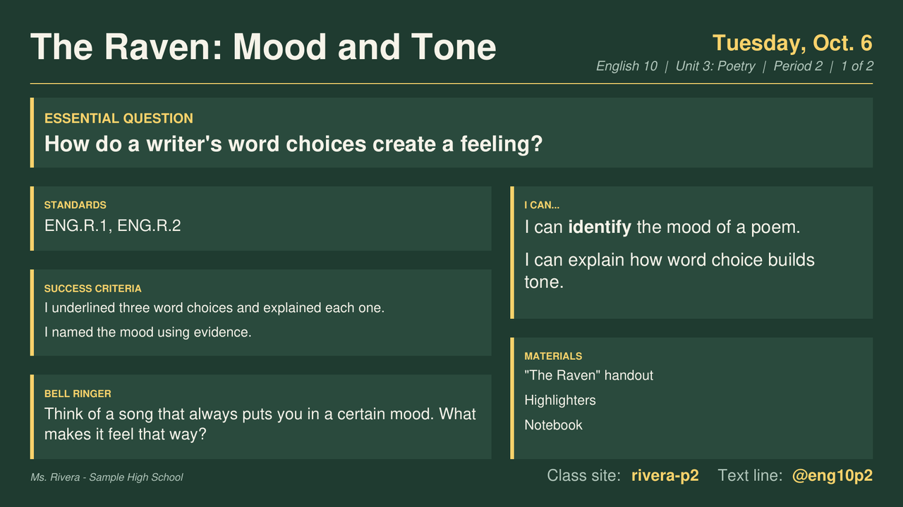
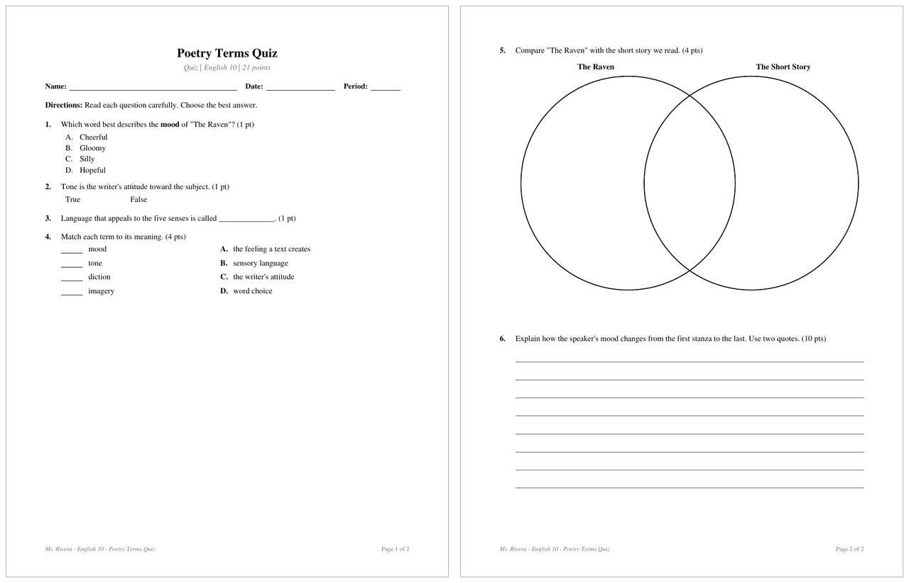

# Chalkboard

A lesson planner and quiz builder for teachers. Plan a lesson, put it on the
board, and print the handouts, all from one app. Chalkboard works completely
offline: no accounts, no internet, no AI. Everything in it is written by you.

**Chalkboard** opens in a window with buttons and menus. It can also switch to a
retro green-screen **terminal view** in the same window (View menu, or
Ctrl+Shift+W). **Chalkboard Terminal** is the same planner for people who'd
rather work in a terminal.

## How it works

**1. Plan the lesson.** Fill in the parts you use: standards, "I can"
statements, success criteria, an Essential Question, vocabulary, bell ringer,
I Do / We Do / You Do, exit ticket, homework. Hide the sections you don't
need, and everything saves by itself.

**2. Put it on the board.** One click turns the lesson into a 1920×1080 slide
for your classroom display, plus an editable slideshow for PowerPoint,
Keynote, or Google Slides. The text sizes itself to be readable from the
back row, and each class period gets its own class codes.



**3. Build the quiz or worksheet.** Add multiple choice, true/false,
fill-in-the-blank, matching, short and extended response, reading passages,
and graphic organizers (Venn diagrams, T-charts, K-W-L, Frayer models, and
more). Chalkboard adds up the points, makes the answer key, and can shuffle
up to four versions.

**4. Print it or share it.** Export to PDF, or to Word (it also opens in
Google Docs). Plain text is ready to paste into Google Classroom or another
LMS. A make-up sheet for absent students is one more click.



*Screenshots use made-up sample data.*

## Everything it does

- **Lesson plans**: title, unit, dates, standards, learning targets, success
  criteria, materials, bell ringer, I Do / We Do / You Do, closure,
  differentiation, checks for understanding, homework, notes
- **SEL bell ringers**: no warm-up planned? Press `G` for a random
  social-emotional learning prompt (137 built in). Chalkboard avoids prompts your
  other lessons already use.
- **Bold, italic, underline**: type `**bold**`, `*italic*`, or `__underline__`
  in any lesson section, question, or directions. In the terminal editor,
  Ctrl-B, Ctrl-T, and Ctrl-U add them around the word at the cursor (press
  again to take them off), and the text shows up bold, italic, or underlined
  as you type. PDF, Word, and board slides print the formatting; plain text
  leaves the marks out. Fill-in-the-blank lines (`___`) and math like
  `5 * 3` are left alone.
- **Assessments & assignments**: quizzes, tests, worksheets, exit tickets, homework
  - multiple choice, true/false, short answer, extended response (lined,
    blank, or boxed space), fill in the blank, matching, reading passages
    with line numbers, section headers
  - charts and graphic organizers for students to fill in: a chart of any
    size (up to 8 columns x 20 rows, with optional headings and row labels
    for a matrix), T-chart, K-W-L, cause & effect,
    Somebody-Wanted-But-So-Then, Venn diagrams (2 or 3 circles), idea web,
    sequence / flow chart, Frayer model, and plot diagram. Charts print as
    real tables in Word, so students can type in them.
  - per-question points and standards, automatic totals
  - answer keys with circled answers and a quick key
  - up to 4 shuffled versions (A = original order). "All of the above" style
    choices stay put, and passages/sections act as anchors.
- **Annotation sheets**: Name / Date, your heading (e.g. "Hamlet 4.1 Annotation"),
  then a Line / Symbol / Reason for Annotating chart (10 rows) filling one
  page. The .docx is the digital copy; its rows grow as students type.
- **Bell ringer sheets**: two pages to print double-sided, Monday-Friday boxes
  for one week per side. Leave the prompts blank or fill any day (SEL prompts
  work here too).
- **Worksheets inside a lesson**: the lesson's "Assessments & Worksheets"
  field builds new quizzes and sheets (they pick up the lesson's unit, course,
  and standards) or links ones you already made. Export All puts them in the
  lesson's folder, and the make-up sheet lists them under What You'll Need.
- **Default materials**: set what you always need under Settings > Default
  Materials Needed, and every new lesson starts with it in Materials & Texts.
- **Finding things**: filter lesson and assessment lists by unit (and
  assessments by type), search, and sort by date modified, date created,
  title, or unit.
- **Standards**: import your state's, district's, or school's standards from
  a CSV or JSON file (see [Standards files](#standards-files)), or type your
  own in. Filter by subject and grade, search, browse, and attach them to
  lessons, assessments, and individual questions.
- **Export**: PDF, Word .docx (also opens in Google Docs, Pages, LibreOffice),
  and plain text for pasting into Google Classroom or an LMS
- **Make-up sheets**: a student-facing PDF (plus an editable .docx) for anyone who missed class, built
  from the lesson: goals, success criteria, materials, then a checklist of
  steps (bell ringer and exit ticket get writing lines) with Name / Date
  Missed / Due and a Turned In / Teacher Initials line. Teacher-only fields
  (differentiation, checks, notes) are left off.
- **Board slides**: a 1920x1080 PNG of a lesson's standards, "I can"
  statements, success criteria, bell ringer, materials, and homework for an
  interactive display, projector, or TV. Text sizes itself to fit, panels move between
  the two columns to keep it as big as possible, and class codes sit in large
  type along the bottom. When a lesson has too much to read from the back of
  the room, standards first shrink to just their codes; if that still isn't
  enough, the board continues on a second slide ("Board 2.png", marked
  "1 of 2" / "2 of 2"). Empty sections are left off. Every board export also
  saves the same slides as a .pptx slideshow beside the PNGs. Everything on it
  is editable: every panel, the title, the date, and the class codes are real
  text boxes, so you can fix a typo, change a code, or reuse it next school
  year without coming back to Chalkboard. Web addresses become links you can
  click. Open it in PowerPoint or Keynote, or upload it to Google Drive and
  open it with Google Slides. Chalkboard (dark green), whiteboard (white), or your school colors
  (HEX codes under Settings for background, headings, and text).

## Install

Download from the
[latest release](https://github.com/themisterdragon/chalkboard/releases/latest).

Everything except the Windows `.exe` needs Python 3.8+ (Macs offer to install it
the first time).

**Mac:** open `Chalkboard-<version>.dmg` and drag Chalkboard to Applications.
Python is built in, so there's nothing else to install. (`Chalkboard-Terminal-<version>.dmg`
is the terminal-only app. It runs in a Terminal window, and its `Read Me First.txt` covers the
first-launch prompts.)

**Windows:** download `Chalkboard-<version>-windows.exe`. Python is built in, so there's
nothing else to install. (`Chalkboard-Terminal-<version>-windows.exe` is the terminal-only
app; it looks best in Windows Terminal.) If "Windows protected your PC" appears, click
More info > Run anyway.

**Linux (or macOS from the terminal):** unpack `chalkboard-<version>-linux.tar.gz`
(it holds `chalkboard.pyz`, `chalkboard-gui.pyz`, and `install.sh`) and run `sh install.sh`
(installs `chalkboard` and `chalkboard-gui` to `~/.local/bin`, plus an app-menu entry for the
window version), or run either directly with `python3 chalkboard.pyz`.

**Python package (any OS, including Windows):**

    pipx install chalkboard_planner-2.0.0-py3-none-any.whl

On Windows this pulls in `windows-curses` automatically.

## Window version

`chalkboard-gui` is the whole planner in a window, with a mouse, menus, and
buttons, in one of three looks (View menu or Settings):

- **Modern**: your computer's own title bar, font, and accent color, with
  flat controls
- **Bevel**: gray 3-D buttons, dark blue title bars, a teal desktop
- **Pinstripe**: black-and-white, striped title bars, a dotted gray desktop

Every look has a light and a dark mode. "Match my computer" (the default)
follows the Windows, macOS, GNOME, or KDE dark-mode setting and switches when
you change it. On Windows and macOS the title bar turns dark too.

Everything the terminal app does is here: lesson plans (with standards,
SEL bell ringers, and linked worksheets), quizzes and tests with
every question type, annotation and bell ringer sheets, the standards
library with import, settings, preview, and every export. It reads and writes
the same data file as the terminal app, and picks up changes the other one
saves. Close a window with its close box (top left) or Esc to go back.

The first time it opens, a setup wizard asks for your name, school, main
class, school colors, and everyday materials, then offers to install it: the
Windows `.exe` into your Programs folder with Start-menu and desktop shortcuts,
the Mac app from its disk image into Applications, or the Linux `.pyz` with an
app-menu entry. Settings > Run Setup Again brings it back.
Text size and overall size are in Settings, and sharp screens get 2× on
their own.

### Window view and terminal view

The window version can also show the terminal app, green screen and all,
inside the same window. Switch back and forth any time with View > Switch to
Terminal View / Switch to Window View, Ctrl+Shift+W (Cmd+Shift+W on a Mac), or
`W  WINDOW VIEW` on the terminal view's main menu. You never close anything,
and both views work on the same open lessons and assessments. It opens in the
view you used last. New copies start in the window view, and setup asks which
one you want.

The terminal view is the real terminal app (the same code), drawn by the window
app itself, so it needs no curses package and works on Windows too. If you'd
rather have just the terminal, `chalkboard` still runs on its own in any
terminal.

### Accessibility

The window version aims at WCAG 2.1 AA, the standard ADA and Section 508
reviews use:

- **Contrast**: every look, light and dark, has at least 4.5:1 contrast for
  text (hints and status text too) and 3:1 for the edges of text boxes,
  lists, and drop-downs and for the keyboard focus ring. Modern uses your
  accent color, darkened or lightened until it passes.
  `python3 scripts/check_contrast.py` checks every palette.
- **Keyboard**: everything works without a mouse. Tab moves between
  controls, Space or Return presses them, arrow keys move through lists, and
  Esc goes back. The control with the keyboard focus always shows a ring.
  Help > Keyboard Shortcuts lists the rest.
- **Size**: text goes up to 24 px (Ctrl+= / Ctrl+-), and "Size of everything"
  in Settings doubles or triples the whole window without cutting anything
  off.
- **Nothing moves or times out**, except the retro welcome screen, which any
  key skips (and Settings turns off).

**Known gap: screen readers.** Tk, the toolkit the window version is built
with, doesn't work with screen readers (VoiceOver, Narrator, NVDA, JAWS,
Orca). The terminal view inside the window is drawn as a picture, so a screen
reader can't read it either. The standalone terminal app (`chalkboard`, run in
a real terminal) may work better with one, but it hasn't been tested with a
screen reader yet.

    chalkboard-gui                    # or: python3 chalkboard-gui.pyz

It needs Tk, which Python from python.org includes on Windows and macOS. On
Linux install it first: `sudo pacman -S tk` (Arch) or
`sudo apt install python3-tk` (Debian/Ubuntu). `install.sh` installs it next
to `chalkboard` and, on Linux, adds a "Chalkboard" app-menu entry.

## Use

    chalkboard            # with boot sequence
    chalkboard --no-boot

Everything autosaves. Number keys or arrows + Return pick items. Esc goes back.

| Where | Keys |
|-------|------|
| Lists | `N` new, `R` rename, `C` copy, `D` delete, `X` export, `P` preview, `/` search, `U` unit filter, `T` type filter (assessments), `O` sort order |
| Lesson | `B` board slide (PNG) and `M` make-up sheet (PDF + DOCX) in one keystroke, `G` random SEL bell ringer (press again for another), `H` annotation sheet as homework, `V` vocab quiz, `S` show/hide sections |
| Lesson > Assessments & Worksheets | `N` build new, `L` link existing, `E` rename, `R` remove from lesson, `+`/`-` reorder |
| Assessment | `A` add question, `S` settings (title, directions, standards), `+`/`-` move, `M` move to position, `K` preview answer key |
| Standards library | `I` import a CSV/JSON file, `E` export yours to share, `X` remove an imported subject, `A` add one by hand, `D` delete one you added |
| Standards picker | number/Space toggle, `V` view full text, `F` subject, `G` grade, `/` search, `S` show selected (the library has `F`, `G`, and `/` too) |
| Yes/no questions | Return or `Y` means yes; `N` or Esc means no |
| Text editor | type freely, `- ` starts a bullet, Esc saves, Ctrl-X cancels; in Bell Ringer, Ctrl-G adds a random SEL prompt |

Fill-in-the-blank: type `___` (three or more underscores) wherever a blank goes.

### School mascot

Settings > School Mascot picks a pixel-art mascot: the ten most common school
mascots (Eagles, Tigers, Bulldogs, Panthers, Wildcats, Lions, Warriors, Knights,
Falcons, Hornets), plus Dragons, Yellow Jackets, Bobcats, Black Bears,
Redhounds, Cardinals, Cougars, Owls, and Wolves. Use Left/Right to browse and
Return to pick. Your mascot appears in the boot sequence and runs along the
progress bar while files export. With no mascot, the Chalkboard logo runs the
bar instead. It's drawn with text characters in the screen color, so it adds
almost nothing to the load on any machine. The mascot is only in the terminal
app and the window version's terminal view; the window view shows a plain
progress bar in its status bar.

### Lesson sections

Settings > Lesson Sections (or Sections… in a lesson) picks which sections the
lesson editor shows, so it's only as long as you need. Two start out hidden:

- **Essential Question**: one line. It goes on the board slide as a banner
  across the top and on the make-up sheet as "Today's Big Question."
- **Vocabulary**: one word per line, `word: definition`. It prints with the
  word in bold, goes on the board slide as "Words to Know," and **Make Vocab
  Quiz** (`V` in the terminal) turns it into a matching quiz linked to the
  lesson.

Hiding a section never deletes anything. A lesson that already has something
in a hidden section still shows it, and it still prints.

### Backups

Settings > **Back Up Now** (in the window version, also File > Back Up Everything) saves
everything into one dated file, like `chalkboard-backup-2026-10-02-1530.json`, in a
folder you pick: a flash drive, a cloud folder, anywhere. Chalkboard remembers the
folder for next time.

Settings > **Import Backup** brings one back, two ways:

- **Add what I don't have**: adds lessons, assessments, and standards that aren't here
  yet, and takes the backup's copy of anything that changed more recently there. Your
  settings stay as they are. Use this to bring work over from another computer.
- **Replace everything**: swaps your lessons, assessments, standards, and settings for
  the backup's (this computer's export and backup folders and window look stay).

Either way, Chalkboard first saves what you had into a `backups` folder next to
`data.json` (the last 10 are kept). A plain `data.json` copied from another
computer imports the same way.

**Export Everything** (Settings in the terminal app, File menu in the window version) makes one
dated folder with every lesson and assessment as PDF and Word, plus a backup file, sorted into
class and unit folders. Keep it, or drag the whole folder into Google Drive or another cloud
folder.

## Offline, and plugins

Chalkboard never goes online. While it runs, a guard (`chalkboard/offline.py`) refuses any
network connection, any program except the few local tools it uses (for board PNGs, opening
your files, and following your computer's dark mode), and any web address, for plugins too.
`scripts/check_offline.py` tests this on every release.

**Plugins** add to Chalkboard without changing it: a new export format, a mascot, or something
that runs after each export. Put a plugin's `.py` file in a `plugins` folder inside the data
folder and restart. `examples/plugins/markdown_export.py` adds a Markdown export. A broken
plugin gets switched off with a note, and Chalkboard keeps working. Start with `--no-plugins` to
skip them all. Plugins are code, so only add ones you trust. To get files into Google Drive or
another cloud, a plugin saves them into the folder that app syncs.

[PORTING.md](PORTING.md) maps the code for anyone building Chalkboard for another system.

## Where things live

| What | Where |
|------|-------|
| Your data | `~/.local/share/chalkboard/data.json` (macOS: `~/Library/Application Support/chalkboard`, Windows: `%APPDATA%\chalkboard`). A `.bak` copy is kept automatically. |
| Imported standards | a `standards` folder next to `data.json`, one JSON file per subject |
| Backups | wherever you pick (Settings > Back Up; first suggested: `~/Documents/Chalkboard/Backups`). Each is one dated `.json` file with your lessons, assessments, settings, and imported standards. |
| Exports | `~/Documents/Chalkboard` (changeable in Settings). Every export is filed by class, then unit, then lesson, like `English 10/Unit 3/The Raven/`; assessments go in their unit folder. A blank course or unit is skipped. Export All also puts a lesson's linked worksheets in its folder. |

Board slides are drawn with the same engine as the PDF, then turned into a PNG
by a tool the computer already has: `sips` on macOS (built in), or poppler's
`pdftoppm`, `mutool`, or Ghostscript on Linux/Windows. Pick which sections
appear under Settings > Board Slide (or from the export screen).

**School logo:** Settings > School Logo takes a PNG or JPEG and puts it left of
the title or in the top right corner of every board slide. A PNG with a
transparent background looks best. Chalkboard keeps its own copy, so the
original file can move.

**Class periods and codes:** teach the same lesson to several classes? Add each
period under Settings > Class Periods & Codes, with its codes one per line
(`Google Classroom: abc123`, `Remind: @eng10p1`; you type the app names
yourself). Exporting a board slide then makes one PNG per period, like
`The Raven - Board (Period 1).png`, each with its own Class Codes panel and the
period's name in the header. Give a period a course to make its slide only for
that course's lessons; leave it blank for every lesson.

## Standards files

Chalkboard doesn't come with any standards. Standards documents are usually
copyrighted by the state or organization that wrote them, so each teacher
brings their own. In the Standards Library, press `I` and type (or drag in) the
path to a `.csv` or `.json` file. Importing a subject again replaces it, and
`X` removes one. Lessons keep the codes they already use.

**CSV** (save from Excel, Numbers, or Google Sheets): the first row holds column
names, in any order. `code` and `text` are required.

| Column | Meaning |
|--------|---------|
| `subject` | Groups standards for the `F` filter. Blank means the file's name. |
| `code` | Unique code, like `RL.9-10.1` |
| `text` | The standard's full text |
| `grades` | `K`, `5`, `9-10`, `K-12`... (used by the `G` filter; anything else always shows) |
| `strand`, `cluster` | Optional headings shown when you view a standard |
| `part_of` | For a lettered or numbered part: its parent's code. The part's code must be the parent's plus a letter (`RL.9-10.1a`) or `.` and a label (`MTH.A.1.1`). |

[`examples/sample-standards.csv`](examples/sample-standards.csv) is a small
made-up example to try.

**JSON**: one subject, or a list of them:

```json
{
  "subject": "English",
  "source": "Where these came from (shown under each standard)",
  "standards": [
    {"code": "ENG.R.1", "grades": "9-10", "strand": "Reading", "cluster": "Evidence",
     "text": "Use details from a text to support what it says.",
     "subs": [["a", "Quote the details that matter most."]]}
  ]
}
```

**Sharing with colleagues:** press `E` in the Standards Library (Export to
Share in the window version) to save the subjects you imported, or the ones
you typed in yourself, as a `.json` file. A colleague imports it with `I`.
It's a file you hand over directly, on a flash drive or in an email; Chalkboard
never sends it anywhere.

Make sure you're allowed to use the standards you import. Many states let
their own teachers copy their standards for classroom use. Chalkboard keeps
them on your computer and never uploads them anywhere.

## Privacy and security

Chalkboard works completely offline and never sends anything anywhere. It has no
accounts, no analytics, and no AI. Everything in it is written by you. The
[security promise](SECURITY.md) spells this out, and says how to report a problem.

## License

Chalkboard is free software under the [GNU General Public License v3.0](LICENSE).
You can use, study, share, and change it. If you distribute a changed version,
you have to share its source under the same license.

Chalkboard isn't affiliated with or endorsed by any state department of
education, standards organization, or hardware maker. Product names mentioned
here belong to their owners.

## Build

    python3 scripts/build_pyz.py       # -> dist/chalkboard.pyz, dist/chalkboard-gui.pyz, dist/install.sh
    python3 scripts/build_mac.py       # -> dist/Chalkboard-Terminal-macOS.zip (also rebuilds the .pyz)
    sh scripts/build_dmg.sh            # -> dist/Chalkboard-Terminal-<version>.dmg (macOS only, after build_mac.py)
    sh scripts/build_mac_window.sh     # -> dist/Chalkboard-<version>.dmg (macOS, needs PyInstaller)
    pip wheel --no-deps -w dist .      # -> dist/*.whl
    python3 scripts/make_icon.py       # -> macos/Chalkboard.icns (only to change the icon)

Pushing a version tag (`git tag v2.0.0 && git push --tags`) builds all of these on
GitHub's Mac and Windows runners (the `.exe` with PyInstaller), tests them, and
attaches them to a draft release.
